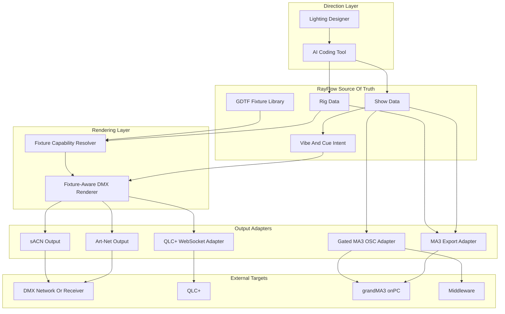

# System Overview

This document provides a high-level overview of the current RayFlow
architecture.

## Architecture Diagram

## Components

### Direction Layer

- **Lighting Designer:** Provides creative direction, reviews generated cues,
  and approves live output.
- **AI Coding Tool:** Reads RayFlow context, edits project files, runs CLI
  commands, and explains diffs before risky operations.

### RayFlow Source Of Truth

- **Show Data:** Song metadata, sections, cues, timestamps, fades, and
  generated intent.
- **Rig Data:** Venue, fixture slots, addresses, positions, presets, and show
  overrides.
- **GDTF Fixture Library:** Fixture definitions and channel capabilities used
  by the renderer.
- **Vibe And Cue Intent:** The creative layer that remains editable by humans
  and AI before it becomes protocol output.

### Rendering Layer

- **Fixture Capability Resolver:** Maps abstract cue attributes such as
  dimmer, RGB color, pan, tilt, beam, and gobo to fixture-specific channels.
- **Fixture-Aware DMX Renderer:** Produces universe/channel values from
  RayFlow show intent. This is the next critical implementation layer.

### Output Adapters

- **Art-Net Output:** Direct DMX transport over UDP 6454.
- **sACN Output:** Direct E1.31 DMX transport over UDP 5568.
- **QLC+ WebSocket Adapter:** Planned structured controller target with a
  queryable API.
- **MA3 Export Adapter:** MVR, command lists, Timecode XML, and handoff bundles
  for grandMA3 workflows.
- **Gated MA3 OSC Adapter:** `/cmd` automation for operations that have live
  evidence and safety guards.

## Data Flow

1. Load fixture and rig data from RayFlow YAML/GDTF assets.
2. Load or generate song sections, vibes, and cues.
3. Resolve cue intent against fixture capabilities.
4. Render to deterministic output artifacts.
5. Apply through a selected backend only when dry-run output and safety checks
   pass.
6. Capture evidence from the backend: DMX frames, query results, exports, or
   explicit manual confirmation.

## Communication Protocols

| Protocol | Purpose | Direction |
|----------|---------|-----------|
| Art-Net | DMX over UDP | RayFlow -> receiver/fixtures/controller |
| sACN (E1.31) | DMX over multicast or unicast UDP | RayFlow -> receiver/fixtures/controller |
| WebSocket | Structured controller control/query | RayFlow <-> QLC+ |
| OSC | Console or middleware remote control | RayFlow -> MA3/middleware |
| MVR | Stage/rig file exchange | RayFlow -> console/visualizer |
| GDTF | Fixture definition | External library -> RayFlow |

## Where RayFlow Adds Value

RayFlow is not trying to replace a professional console. It adds value by
making the creative and technical show plan explicit, reviewable, and
portable:

1. **AI-directed design:** natural-language iteration over structured show data.
2. **Fixture-aware rendering:** translating design intent to valid DMX output.
3. **Backend choice:** direct DMX for deterministic tests, QLC+ for structured
   open-source control, MA3 for professional compatibility.
4. **Evidence-based automation:** every backend capability must prove state
   changed through queries, captured packets, exports, or recorded manual
   confirmation.

## Why Not Keep MA3 As The Core Layer?

grandMA3 is powerful, but the live probes showed that it is not an ideal
terminal-agent API:

- setup is show-local;
- command acceptance is not equivalent to UDP listener presence;
- command-line destination changes command meaning;
- fixture import and patching are still not repeatable through CLI alone;
- readback is indirect.

Those traits make MA3 a compatibility adapter, not the safest core execution
loop.

## Compatibility Tracks

grandMA3 remains supported where it is strong: professional workflow
compatibility, Timecode XML validation, MVR review, and venue handoff. It should
not be treated as the only runtime while fixture import, command mutation, and
readback remain evidence-gated.
