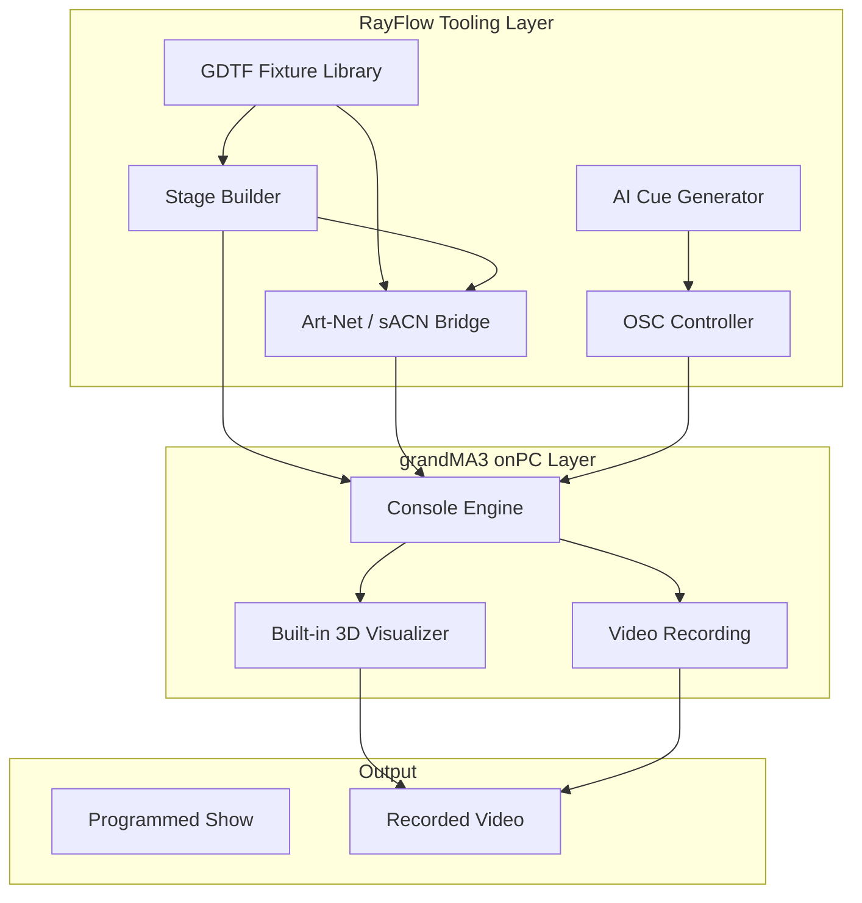

# System Overview

This document provides a high-level overview of the RayFlow system architecture.

## Architecture Diagram

## Components

### RayFlow Tooling Layer

- **GDTF Fixture Library:** Parse and manage GDTF fixture profiles from gdtf-share.com. Extract channel definitions, physical properties, and wheel data.
- **Stage Builder:** Create virtual stage rigs by patching fixtures to DMX universes and arranging them in 3D space. Export as MVR for import to grandMA3.
- **AI Cue Generator:** Generate lighting cues from natural language descriptions (e.g., "warm verse build with slow color fade"). Uses LLM prompting to produce cue stacks.
- **Art-Net / sACN Bridge:** Send and receive DMX values over the network. Communicate with grandMA3 onPC and external visualizers.
- **OSC Controller:** Send commands to grandMA3 onPC via OSC for automation (store cues, trigger sequences, batch operations).

### grandMA3 onPC Layer

- **Console Engine:** The core lighting control software. Handles cue lists, executors, effects, and DMX output. Free for macOS with up to 4096 parameters.
- **Built-in 3D Visualizer:** MA3 includes a 3D visualizer for previewing shows. Accepts MVR files for stage geometry and GDTF fixtures.
- **Video Recording:** MA3 can record visualizer output for export as video — the primary output format for practice sessions.

### Output

- **Programmed Show:** A complete cue list with timing, effects, and fixture programming ready for playback.
- **Recorded Video:** Video capture of the 3D visualizer showing the programmed show — used for review, portfolio, and sharing.

## Data Flow

1. **Load fixtures** from GDTF library → RayFlow parses and catalogs
2. **Build stage** by patching fixtures to universes → RayFlow generates MVR
3. **Import MVR** to grandMA3 onPC → Visualizer shows the rig
4. **Program cues** manually or via AI → Cue list built in MA3
5. **Record output** from visualizer → Video file exported
6. **Review and iterate** → Adjust cues, re-record

## Communication Protocols

| Protocol | Purpose | Direction |
|----------|---------|-----------|
| Art-Net | DMX over UDP | Bidirectional |
| sACN (E1.31) | DMX over multicast UDP | Bidirectional |
| OSC | Console remote control | RayFlow → MA3 |
| MVR | Stage/rig file exchange | RayFlow → MA3 |
| GDTF | Fixture definition | External → RayFlow |
