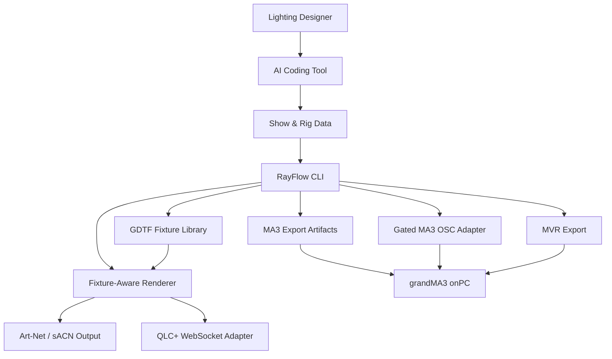

# Project Charter

This document is the single source of truth for RayFlow's goals, scope, and technical context.

## Project Overview

**Project Name:** RayFlow

**Project Vision:** An AI-assisted lighting design toolkit for creating song-based concert lighting shows from structured, backend-neutral show intent. RayFlow provides the design intelligence layer, manages rigs and fixture capabilities, renders cues into deterministic output artifacts, and supports multiple execution backends.

**Technical Goal:** Build a framework where a lighting designer can pick a song, work with an AI to develop a rig and show, direct the AI through iterative refinement, and execute or export the result through direct DMX, structured controller APIs, or professional console compatibility adapters.

## Users & User Stories

### Primary Persona

**Target User:** Lighting designers and students learning concert lighting programming.

- **Name:** Connor (designer/learner)
- **Role:** Lighting designer creating shows for recorded music
- **Pain Points:** Building a show from scratch is slow; expensive visualizers; no easy way to iterate on creative ideas; repetitive console programming
- **Goals:** Create professional-quality timecoded light shows using AI assistance, practice lighting design on a computer, automate repetitive console tasks

### Core User Stories

**Story 1:** As a lighting designer, I want to define a rig with fixtures and presets so that I have a reusable foundation for show design.

- Priority: Must-have

**Story 2:** As a learner, I want to load GDTF fixture profiles so that I can work with real-world fixture data.

- Priority: Must-have

**Story 3:** As a programmer, I want RayFlow to render AI-generated cues into deterministic DMX values so that I can test and execute show intent without depending on console UI mutation.

- Priority: Must-have

**Story 4:** As a designer, I want to direct an AI in natural language to build and refine a lighting show so that I can focus on creative decisions.

- Priority: Must-have

**Story 5:** As a designer, I want to export my completed show to professional console formats when a venue or workflow requires them.

- Priority: Should-have

**Story 6:** As a designer, I want to drive an API-first controller such as QLC+ so that I can run structured cue shows with queryable state and manual override.

- Priority: Should-have

## Features & Scope

### Must-Have (MVP)

**Feature A:** Art-Net/sACN bridge — send and receive DMX universes from Python

- User Story: Story 3
- Implementation: Phase 2

**Feature B:** GDTF fixture parser — load and manage fixture definitions

- User Story: Story 2
- Implementation: Phase 3

**Feature C:** Backend-neutral DMX rendering — translate RayFlow cues into universe/channel values

- User Story: Story 3
- Implementation: Phase 8

**Feature D:** Show & Rig Framework — data model for rigs, shows, presets, and vibes

- User Story: Story 1
- Implementation: Phase 5

**Feature E:** AI Show Builder — natural-language-driven cue generation and refinement

- User Story: Story 4
- Implementation: Phase 6

### Should-Have (Post-MVP)

**Feature F:** API-first controller adapter — QLC+ WebSocket execution and state query

- User Story: Story 6
- Implementation: Phase 8

**Feature G:** Export & Playback — MA3-compatible export with timecode

- User Story: Story 5
- Implementation: Phase 7 compatibility track

**Feature H:** grandMA3 gated OSC integration — remote control only for verified operations

- User Story: Story 5
- Implementation: Compatibility track

### Out of Scope

- Hardware DMX output (USB-DMX interfaces)
- Full grandMA3 console replacement
- Production show playback
- Multi-user collaborative programming
- Full custom 3D visualizer as a prerequisite for the control backend

## Architecture

### High-Level Summary

RayFlow has five main components: AI-readable show/rig data, a GDTF fixture library, a fixture-aware renderer, protocol/controller adapters, and professional console compatibility exporters. The show/rig data is the source of truth; adapters translate that state into DMX frames, QLC+ WebSocket commands, MA3 export artifacts, or gated MA3 OSC commands.

### System Diagram

## Technology Stack

| Category | Technology | Version | Notes |
|----------|------------|---------|-------|
| Package Management | uv | latest | Python package manager |
| Core Language | Python | 3.10+ | Primary programming language |
| Console Compatibility | grandMA3 onPC | 2.3.2.0 baseline | Export/playback target, not core execution loop |
| Controller Adapter | QLC+ WebSockets | planned | API-first structured controller path |
| Art-Net | artnet / custom | — | DMX over UDP |
| sACN | sacn | 1.0+ | E1.31 streaming |
| OSC | python-osc | 1.8+ | Gated remote console or middleware control |
| Fixtures | GDTF | — | Open fixture format |
| Data Format | YAML + JSON | — | Show/rig serialization |
| AI Interface | LLM API | Any | Claude, GPT, etc. via coding tools |
| Linting | Ruff | 0.5+ | Format and lint |
| Testing | Pytest | 8.x | Test framework |
| Documentation | MkDocs + Material | — | Project docs |

## Risks & Assumptions

### Key Assumptions

- Direct Art-Net/sACN output can cover the first deterministic execution milestone
- QLC+ WebSocket control remains available and stable enough for a research spike
- grandMA3 onPC remains useful for compatibility testing and MA deliverables
- Art-Net and sACN protocols are stable and well-documented
- GDTF fixture library is available from gdtf-share.com
- AI coding tools can effectively work with structured YAML data and existing Python modules

### Technical Risks

| Risk | Probability | Impact | Mitigation |
|------|-------------|--------|------------|
| grandMA3 onPC macOS compatibility breaks | Low | Medium | Keep MA3 as compatibility adapter, not core loop |
| Art-Net library unmaintained | Medium | Medium | Build minimal custom implementation as fallback |
| GDTF parsing complexity | Medium | Medium | Start with common fixture types, expand iteratively |
| AI prompt quality | High | High | Iterate on prompt templates, provide rich context bundles |
| Fixture-aware DMX rendering misses real fixture behavior | Medium | High | Validate against GDTF channel maps and captured DMX frames |
| QLC+ WebSocket behavior differs from docs | Medium | Medium | Build a small spike with command/query evidence |
| MA3 OSC/API readback incomplete | High | Medium | Treat as gated compatibility work; do not block backend-neutral MVP |

## Decision Log

| Date       | Decision                                    | Context / Drivers                                           | Impact / Follow-up                                    |
|------------|---------------------------------------------|-------------------------------------------------------------|-------------------------------------------------------|
| 2026-05-15 | grandMA3 onPC as console emulator           | Free, macOS native, industry standard                       | Primary console for all development                   |
| 2026-05-15 | Python for protocol bridge                  | Rich ecosystem (sacn, python-osc), AI-friendly              | Core of all lighting communication                    |
| 2026-05-15 | GDTF as fixture standard                    | Open, supported by grandMA3, manufacturer-backed            | All fixtures use GDTF format                          |
| 2026-05-17 | AI-as-primary interface                     | Designer directs AI in natural language; AI handles translation to MA3 | RayFlow's primary user is a human working through an AI coding tool |
| 2026-05-17 | Drop built-in web visualizer                | grandMA3 onPC has built-in 3D visualizer; redundant         | Focus on show/rig data model and AI interaction layer |
| 2026-05-17 | MA3-native export as target format          | Industry standard; leverages existing MA3 investment        | MVR for rig + OSC cues + timecode for playback        |
| 2026-05-23 | Backend-neutral control loop                | MA3 live probes exposed fragile command acceptance, fixture import, and readback; manual research favors API-first targets | RayFlow show data becomes source of truth; next work prioritizes DMX renderer, Art-Net/sACN execution, QLC+ adapter, and MA3 compatibility gating |
