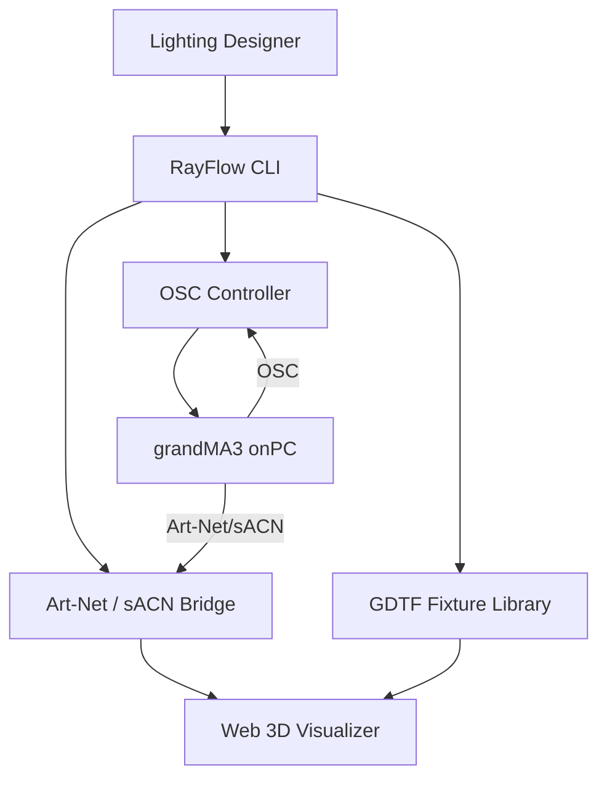

# Project Charter

This document is the single source of truth for RayFlow's goals, scope, and technical context.

## Project Overview

**Project Name:** RayFlow

**Project Vision:** A personal toolkit for exploring concert lighting design — combining grandMA3 onPC as a console emulator with Python-based protocol bridges and a web 3D visualizer for testing looks, cues, and stage designs.

**Technical Goal:** Build a working Art-Net/sACN bridge that can send DMX to a visualizer, load GDTF fixtures, and integrate with grandMA3 onPC via OSC — all controllable from a Python CLI.

## Users & User Stories

### Primary Persona

**Target User:** Lighting designers and students learning concert lighting programming.

- **Name:** Connor (designer/learner)
- **Role:** Lighting designer exploring show programming
- **Pain Points:** Need hardware console for practice, expensive visualizers, no easy way to test looks without a real rig
- **Goals:** Practice lighting programming on a computer, visualize stage designs, automate repetitive console tasks

### Core User Stories

**Story 1:** As a lighting designer, I want to send DMX from Python to a 3D visualizer so that I can test lighting looks without physical fixtures.

- Priority: Must-have

**Story 2:** As a learner, I want to load GDTF fixture profiles so that I can work with real-world fixture data.

- Priority: Must-have

**Story 3:** As a programmer, I want to control grandMA3 onPC via OSC so that I can automate cue sequences and test workflows.

- Priority: Should-have

**Story 4:** As a designer, I want AI assistance in generating cue stacks and lighting looks so that I can explore creative ideas faster.

- Priority: Should-have

## Features & Scope

### Must-Have (MVP)

**Feature A:** Art-Net/sACN bridge — send and receive DMX universes from Python

- User Story: Story 1
- Implementation: Phase 2

**Feature B:** GDTF fixture parser — load and manage fixture definitions

- User Story: Story 2
- Implementation: Phase 3

**Feature C:** Web 3D visualizer — browser-based stage visualization receiving live DMX

- User Story: Story 1
- Implementation: Phase 5

### Should-Have (Post-MVP)

**Feature D:** grandMA3 onPC OSC integration — remote control and automation

- User Story: Story 3
- Implementation: Phase 4

**Feature E:** AI-assisted cue generation — natural language to cue stack

- User Story: Story 4
- Implementation: Phase 6

### Out of Scope

- Hardware DMX output (USB-DMX interfaces)
- Full grandMA3 console replacement
- Production show playback
- Multi-user collaborative programming

## Architecture

### High-Level Summary

RayFlow has three main components: a Python protocol bridge (Art-Net/sACN/OSC), a GDTF fixture library, and a web-based 3D visualizer. grandMA3 onPC runs alongside as the console emulator, communicating via network protocols.

### System Diagram

## Technology Stack

| Category | Technology | Version | Notes |
|----------|------------|---------|-------|
| Package Management | uv | latest | Python package manager |
| Core Language | Python | 3.10+ | Primary programming language |
| Console | grandMA3 onPC | 2.3.2.0 baseline | macOS native, locally verified |
| Art-Net | artnet / custom | — | DMX over UDP |
| sACN | sacn | 1.0+ | E1.31 streaming |
| OSC | python-osc | 1.8+ | Remote console control |
| Fixtures | GDTF | — | Open fixture format |
| Visualizer | Three.js + Flask | — | Browser-based 3D |
| Linting | Ruff | 0.5+ | Format and lint |
| Testing | Pytest | 8.x | Test framework |
| Documentation | MkDocs + Material | — | Project docs |

## Risks & Assumptions

### Key Assumptions

- grandMA3 onPC remains free and available for macOS
- Art-Net and sACN protocols are stable and well-documented
- GDTF fixture library is available from gdtf-share.com

### Technical Risks

| Risk | Probability | Impact | Mitigation |
|------|-------------|--------|------------|
| grandMA3 onPC macOS compatibility breaks | Low | High | Test on each new release |
| Art-Net library unmaintained | Medium | Medium | Build minimal custom implementation as fallback |
| GDTF parsing complexity | Medium | Medium | Start with common fixture types, expand iteratively |
| Web visualizer performance | Medium | Low | Use Three.js instancing, limit fixture count initially |

## Decision Log

| Date       | Decision                                    | Context / Drivers                                           | Impact / Follow-up                                    |
|------------|---------------------------------------------|-------------------------------------------------------------|-------------------------------------------------------|
| 2026-05-15 | grandMA3 onPC as console emulator           | Free, macOS native, industry standard                       | Primary console for all development                   |
| 2026-05-15 | Web-based 3D visualizer (Three.js)          | Cross-platform, no install, easy to extend                  | Separate from grandMA3 built-in viz                   |
| 2026-05-15 | Python for protocol bridge                  | Rich ecosystem (sacn, python-osc), AI-friendly              | Core of all lighting communication                    |
| 2026-05-15 | GDTF as fixture standard                    | Open, supported by grandMA3, manufacturer-backed            | All fixtures use GDTF format                          |
